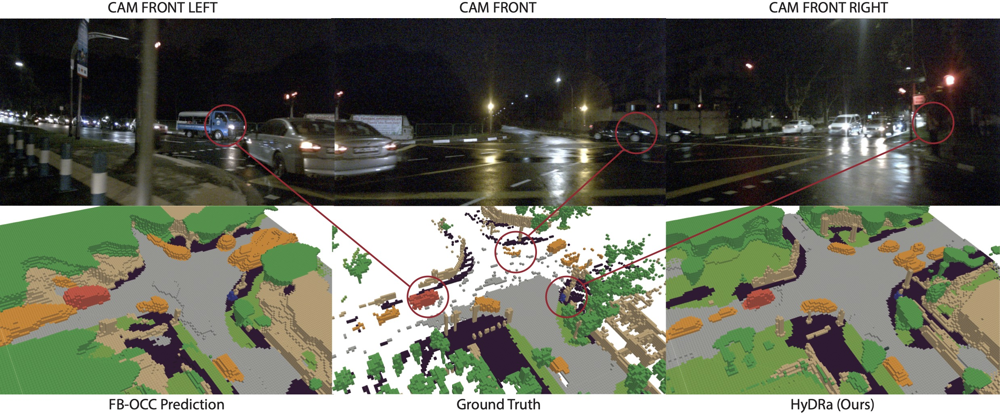

# HyDRa
**Unleashing HyDRa: Hybrid Fusion, Depth Consistency and Radar for Unified 3D Perception**

Philipp Wolters, Johannes Gilg, Torben Teepe, Fabian Herzog, Anouar Laouichi, Martin Hofmann, Gerhard Rigoll

[](https://arxiv.org/abs/2403.07746)
[](https://paperswithcode.com/sota/3d-object-detection-on-nuscenes-camera-radar?p=unleashing-hydra-hybrid-fusion-depth)
[](https://paperswithcode.com/sota/3d-multi-object-tracking-on-nuscenes-camera-2?p=unleashing-hydra-hybrid-fusion-depth)

## Introduction

This repository is an official implementation of [HyDRa](https://arxiv.org/abs/2308.02236), our novel camera-radar fusion architecture for 3D perception. 

<p align="center">

</p>

## News
- `[2024/3/19]` Official PyTorch implementation is coming soon.
- `[2024/3/12]` Our preprint is available on [arXiv](https://arxiv.org/abs/2308.02236).

## Getting Started

## Model Zoo

### 3D Object Detection on [nuScenes](https://www.nuscenes.org/object-detection?externalData=all&mapData=all&modalities=Camera%2C%20Radar)
| Method | Backbone |  NDS  |  mAP  |   Config    |   Checkpoint   |
| :----: | :------: | :---: | :---: | :---------: | :------------: |
| HyDRa  |   R50    | 58.5  | 49.4  | [config](x) | [model](x.pth) |
| HyDRa  |   R101   | 61.7  | 53.6  | [config](x) | [model](x.pth) |
| HyDRa  |  V2-99   | 64.2  | 57.4  | [config](x) | [model](x.pth) |

### 3D Semantic Occupancy Prediction on [Occ3D](https://github.com/Tsinghua-MARS-Lab/Occ3D)
| Method | Backbone | mIoU  |   Config    |   Checkpoint   |
| :----: | :------: | :---: | :---------: | :------------: |
| FB-OCC |   R50    | 39.1  | [config](x) | [model](x.pth) |
| HyDRa  |   R50    | 44.4  | [config](x) | [model](x.pth) |

## Citation
If this work is helpful for your research or applications, please consider giving us a star 🌟 and citing it by the following BibTeX entry.
```bibtex
@article{wolters2024unleashing,
  title={Unleashing HyDRa: Hybrid Fusion, Depth Consistency and Radar for Unified 3D Perception},
  author={Wolters, Philipp and Gilg, Johannes and Teepe, Torben and Herzog, Fabian and Laouichi, Anouar and Hofmann, Martin and Rigoll, Gerhard},
  journal={arXiv preprint arXiv:2403.07746},
  year={2024}
}
```

## Acknowledgements

We would like to thank other great open source projects:

- [BEVDet](https://github.com/HuangJunJie2017/BEVDet), [SoloFusion](https://github.com/Divadi/SOLOFusion), [FB-BEV](https://github.com/NVlabs/FB-BEV) , [CRN](https://github.com/youngskkim/CRN), [Occ3D](https://github.com/Tsinghua-MARS-Lab/Occ3D)